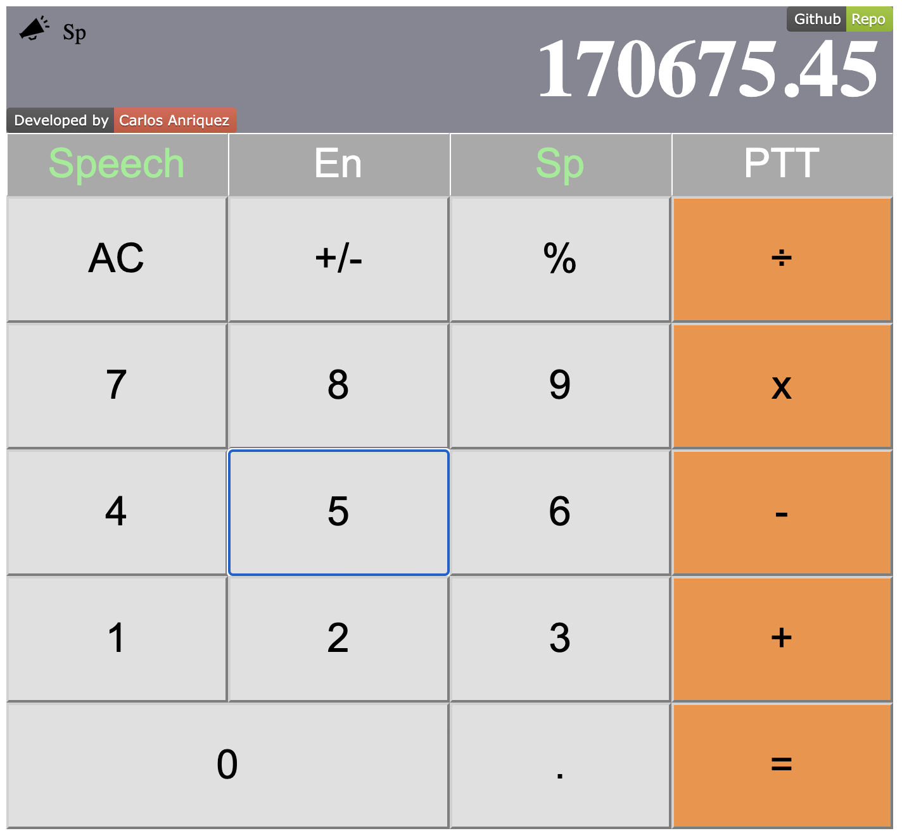

[](https://app.netlify.com/sites/anriquez-calculator/deploys)

# Accesible React Calculator

> Accessibility focused basic React calculator bootstrapped with create-react-app



- Calculator App with a strong focus on accessibility built with React.js. Practicing React Component classes, states, props, and AWS Polly.
- This project is far from perfect. I decided to practice some basic ideas about accessibility by implementing full control via keyboard/mouse.
- This project is also a practice implementation for the AWS service [Amazon Polly](https://aws.amazon.com/polly/)


## How to use it.

### Normal operation

- You can use the calculator by clicking on the buttons or touch screen device as a standard calculator.
- You can key the numbers and operations using the keyboard. 
#### Special Keys:
- ```Enter```              => '='
- ```delete/backspace```   => 'AC'
- ```_```     =>    '+/-'
- ``` / ```   => Division symbol
- ``` * or x ``` => Multiplication Symbol

### Activate Text to Speech functionality:
- Touch/Click: Speech function is activated clicking/touching the button `Speech`. 
- Keyboard: Typing the key 's' (lower case)
- On activation, you will hear a voice with an activation message en English (default language).
- A Icon   will appear on display to indicate the Text to Speech activation. 

### Change text to speech-language :  Spanish / English
- Touch/Click: on buttons `En` or `Sp` for language toggling.
- Keyboard: Typing the key 'l' (lower case) for language toggling.
- On Toggling, you will hear a voice on the selected language. The proper Icons will appear on Display.

### Push To Talk functionality: PTT
- Touch/Click: on PTT button for PTT function activation.
- Keyboard: Typing the key 'p' (lower case) for the push to talk function.
- On activation, this function will read out loud the Display contents.
- A similar effect can be achieved by using the '=' sign.

## Built With

- React.js, Webpack, Babel
- HTML5/CSS3, Javascript ES6
- ESlint, Stylelint
- VSCode
- AWS Polly


## Live Demo on Netlify
[](https://app.netlify.com/sites/anriquez-calculator/deploys)

[Live Demo Link](https://anriquez-calculator.netlify.app/)


## Getting Started


This project was bootstrapped with [Create React App](https://github.com/facebook/create-react-app).


To get a local copy up and running, follow these simple example steps.

### Prerequisites

### Amazon Polly Setup

- Create a ```.env``` file in the root of the project and include your own AWS Amazon Polly credentials. YOu can use as reference the file included in the repo ```.env.example```

```
REACT_APP_AWS_ACCESS_KEY_ID = ''
REACT_APP_AWS_SECRET_ACCESS_KEY = ''
```

## Install

### `yarn start`

Runs the app in the development mode.<br />
Open [http://localhost:3000](http://localhost:3000) to view it in the browser.

The page will reload if you make edits.<br />
You will also see any lint errors in the console.

### `yarn build`

Builds the app for production to the `build` folder.<br />
It correctly bundles React in production mode and optimizes the build for the best performance.

The build is minified and the filenames include the hashes.<br />
Your app is ready to be deployed!

See the section about [deployment](https://facebook.github.io/create-react-app/docs/deployment) for more information.


## Authors

👤 ***Carlos Anriquez***

- Github: [@canriquez](https://github.com/canriquez)
- Twitter: [@cranriquez](https://twitter.com/cranriquez)
- Linkedin: [linkedin](https://www.linkedin.com/in/carlosanriquez/)
- Portfolio: [carlosanriquez.com](https://www.carlosanriquez.com)


## 🤝 Contributing

Contributions, issues, and feature requests are welcome!

Feel free to check the [issues page](issues/).

## Show your support

Give a ⭐️ if you like this project!

## Acknowledgments

- My Family
- The Beagles!
## 📝 License

This project is [MIT](lic.url) licensed.
